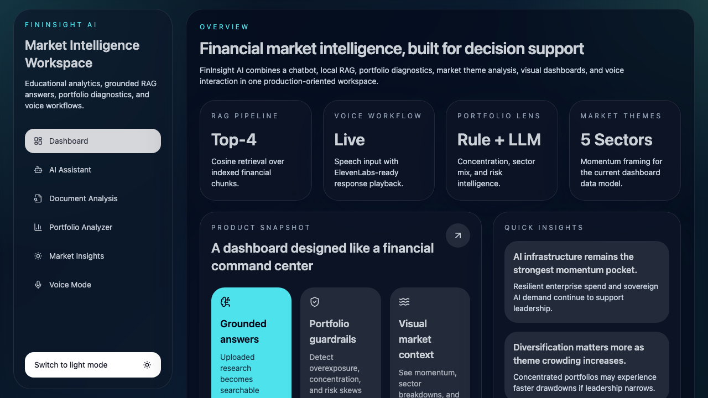
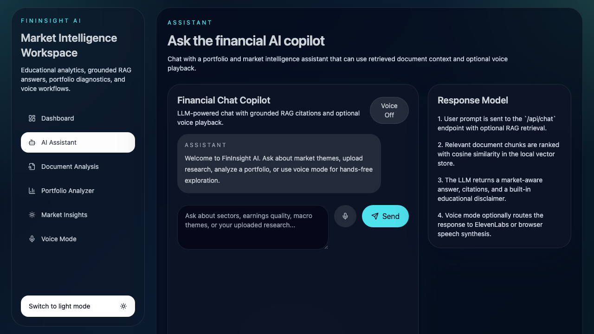
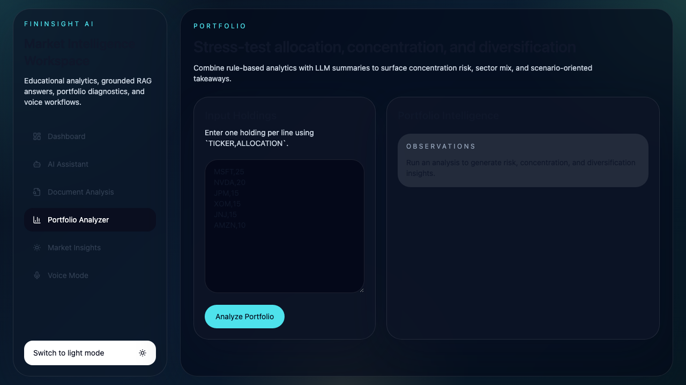

# FinInsight AI

FinInsight AI is a full-stack financial market intelligence workspace built with Next.js App Router, TailwindCSS, Framer Motion, Recharts, Zustand, and a modular AI service layer. It combines a financial chatbot, document-grounded RAG, portfolio analysis, market theme exploration, visual analytics, and voice interaction in one production-oriented web application.

This application is for educational purposes only and does not provide financial advice.

## Screenshots

### Dashboard



### AI Assistant



### Portfolio Analyzer



## Features

- Dashboard with overview cards, quick insights, and fintech-style glassmorphism UI
- AI assistant with chat, RAG citations, streaming-like interaction flow, and optional voice playback
- Document analysis for PDF and TXT uploads with chunking, embeddings, retrieval, and grounded answers
- Portfolio analyzer with diversification scoring, sector concentration logic, risk observations, and charts
- Market insights assistant with theme summaries, momentum data, and visual analytics
- Voice mode using browser speech recognition plus ElevenLabs-ready text-to-speech
- Dark and light themes, motion-driven transitions, and reusable modular components

## Tech Stack

- Frontend: Next.js App Router, React, TailwindCSS, Framer Motion, Recharts, Zustand
- Backend: Next.js route handlers with modular controller and service layers
- AI: Provider-agnostic LLM client supporting Groq/OpenAI-style chat completion APIs
- RAG: Local chunking, lightweight embeddings, JSON vector persistence, cosine similarity retrieval
- Voice: Web Speech API on the client, ElevenLabs text-to-speech on the backend

## Project Structure

```text
app/
  (dashboard)/
    page.tsx
  (assistant)/
    chat/
      page.tsx
    documents/
      page.tsx
    voice/
      page.tsx
  (analysis)/
    market/
      page.tsx
    portfolio/
      page.tsx
  api/
  layout.tsx
src/
  frontend/
    components/
    store/
  backend/
    ai/
    controllers/
    modules/
    routes/
    services/
  shared/
    data/
    lib/
    types/
scripts/
  smoke-test.ts
```

### Folder Segmentation

- `app/`: Next.js App Router entrypoints, route groups, layouts, and HTTP route handlers
- `src/frontend/`: client-facing UI, charts, page panels, app shell, and Zustand state
- `src/backend/`: server-side AI logic, controllers, business modules, and API response helpers
- `src/shared/`: reusable types, utility helpers, environment access, and static data used across both sides

### Route Groups

- `app/(dashboard)`: landing experience and top-level overview screens
- `app/(assistant)`: conversational and document-driven workflows such as chat, RAG, and voice
- `app/(analysis)`: deeper analytical experiences such as portfolio and market intelligence
- Route groups improve readability in the codebase without changing the public URLs

## Environment Variables

Copy `.env.example` to `.env.local` and fill in the values you want to use.

```bash
LLM_API_KEY=
LLM_PROVIDER=groq
LLM_MODEL=llama-3.3-70b-versatile
LLM_BASE_URL=
ELEVENLABS_API_KEY=
ELEVENLABS_VOICE_ID=
PORT=3000
NEXT_PUBLIC_API_BASE_URL=http://localhost:3000
```

### Notes

- If `LLM_API_KEY` is missing, the app falls back to deterministic local responses so the UI and APIs still work during setup.
- If `ELEVENLABS_API_KEY` is missing, voice output falls back to browser speech synthesis.

## Getting Started

```bash
npm install
npm run dev
```

Open `http://localhost:3000`.

## API Endpoints

- `GET /api/test-env`
- `POST /api/chat`
- `POST /api/rag/upload`
- `POST /api/rag/query`
- `POST /api/portfolio/analyze`
- `POST /api/market/insights`
- `POST /api/voice/speak`

## Architecture Overview

### 1. Chat + LLM Layer

- `src/backend/ai/llmClient.ts` centralizes provider-aware chat completion calls.
- `src/backend/ai/llmService.ts` wraps model execution with safe fallbacks.
- `src/backend/services/chatService.ts` combines direct chat reasoning with optional RAG evidence.

### 2. RAG Pipeline

The RAG flow is:

1. Upload PDF or TXT through `POST /api/rag/upload`
2. Extract text with `pdf-parse` for PDFs or UTF-8 decoding for text
3. Chunk text into overlapping segments
4. Generate lightweight local embeddings
5. Persist chunks and embeddings to `data/vector-store.json`
6. Retrieve top-k chunks by cosine similarity
7. Build grounded context for the LLM
8. Return answer plus citations

### 3. Portfolio Analysis Logic

Portfolio analysis combines rule-based heuristics and LLM summarization:

- Normalizes allocations to 100%
- Maps tickers to sector/risk profiles
- Computes weighted portfolio risk
- Detects large-position concentration
- Detects sector concentration
- Generates a diversification score
- Returns allocation, sector, and trend datasets for charts
- Adds an LLM-written educational summary

### 4. Market Insights Logic

- Uses a structured local market theme dataset
- Ranks themes by momentum
- Produces supporting data for charts
- Generates summary, opportunities, and risks
- Uses the LLM abstraction with a deterministic fallback path

### 5. Voice Integration

- Input: Browser Web Speech API captures microphone input on the client
- Output: Backend route calls ElevenLabs when configured
- Fallback: Browser `speechSynthesis` is used when ElevenLabs is unavailable

## Production Notes

- No secrets are hardcoded
- AI and voice providers are environment-driven
- Vector persistence is local JSON for simplicity and portability
- Route handlers use a modular controller/service layout for maintainability
- The UI uses reusable components rather than page-specific one-offs

## Validation

Run the local checks:

```bash
npm run dev
npm run check
npm run smoke
npm run build
```

### Smoke Test Notes

- The smoke test at `scripts/smoke-test.ts` performs real HTTP calls against the local Next.js server.
- Start the app first with `npm run dev` or `npm run start`, then run `npm run smoke`.
- The script loads `.env.local` with `@next/env` so it resolves the same values used by Next.js.
- `GET /api/test-env` confirms whether `LLM_API_KEY` and `ELEVENLABS_API_KEY` are present on the server without exposing the secrets themselves.
- Only `NEXT_PUBLIC_*` variables are exposed to client-side code; server-side route handlers can safely read `process.env.LLM_API_KEY` and `process.env.ELEVENLABS_API_KEY`.

## Future Extensions

- Replace local embeddings with hosted embeddings for higher retrieval quality
- Add portfolio performance import from brokerage exports
- Add streaming responses through Server-Sent Events
- Add authentication and per-user document namespaces
- Swap the local vector store for PostgreSQL + pgvector or a hosted vector DB

Developed and maintained by Ayan113.
